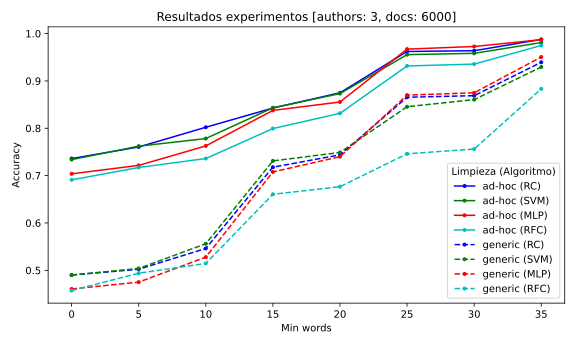
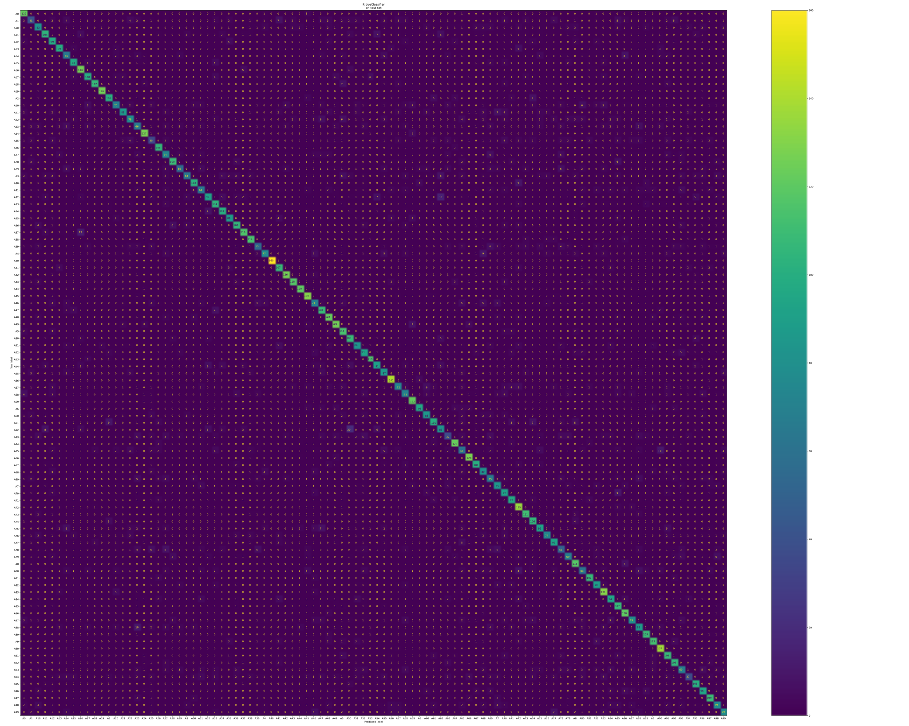

# TFG - Atribución Automática de Autoría de foros

   <a href="https://creativecommons.org/licenses/by-nc-sa/4.0/"></a>

Este es el repositorio de código correspondiente al Trabajo de Fin de Grado de Ingeniería Informática.

## Resumen Investigación

En esta investigación se analiza la **atribución automática de autoría de publicaciones de foros** utilizando técnicas
de **minería de texto**. Concretamente, se ha comparado entre el uso de técnicas de limpieza de texto genéricas y
técnicas _ad-hoc_. Se utilizaron diferentes combinaciones de conjuntos de datos, que consistían en un corpus de 6000
documentos escritos por 3 autores, con límites mínimos de palabras variables, que iban desde 0 hasta 35 palabras.

Los resultados demuestran que las técnicas _ad-hoc_ superan a las genéricas, con una precisión media del 85% en
comparación con el 69% de las técnicas genéricas. Los mejores resultados se obtuvieron al considerar un límite mínimo de
palabras de 35, lo que supuso un _dataset_ con un promedio de 89.2 palabras por documento. El perceptrón multicapa y el
regresor de Ridge lograron ambos una precisión del 98.7%. Estos hallazgos resaltan la importancia de considerar
características lingüísticas específicas del autor y utilizar técnicas de limpieza de texto ad-hoc en tareas de
atribución de autoría.

[Ver datos de resultados](#resultado)

## Herramienta para la atribución automática de autoría

Dentro de la carpeta [attribution](./attribution) se encuentra el código fuente de la herramienta utilizada para llevar
a cabo la investigación. En el siguiente enlace se puede ver el resultado de una ejecución con una muestra de 10,000
publicaciones de 10 autores diferentes.

[Ver notebook](./Atribucion%20Autoria%20Foros.ipynb)

## Web Scraper

Dentro de la carpeta [scraper](./scraper) se encuentra la implementación del web scraper utilizado para la construcción
del dataset.

### Uso

Para ejecutar el scraper es necesario tener instalado Java 8 o superior y ejecutar el siguiente comando:

```code
> java -jar web-scraper-0.1.0.jar [opciones] 
```

| Opción | Nombre Argumento | Descripción                                                                                       |
|--------|------------------|---------------------------------------------------------------------------------------------------|
| -ap,   | --atrpage        | Atributo de página de la url. p. e. page='pag' en https://foro.com/showthread.php?t=9077911&pag=1 |
| -d,    | --directory      | Directorio de salida                                                                              |
| -eh,   | --endHilo        | Hilo del foro final. Valor final del atributo de la url. p.e. t=90.                               |
| -ep,   | --endpage        | Página final. Valor final del atributo de la url.                                                 |
| -f,    | --file           | Nombre del archivo de salida                                                                      |
| -h,    | --help           | Mostrar ayuda                                                                                     |
| -ih,   | --iniHilo        | Hilo del foro de inicio. Valor inicial del atributo de la url. p.e. t=1                           |
| -ip,   | --initpage       | Página de inicio. Valor inicial del atributo de la url.                                           |
| -t,    | --numThread      | Número de hilos de ejecución. Cada hilo ejecuta un número de hilos de scraping.                   |

## Dataset

El dataset recopilado con el scraper y utilizado en este proyecto de investigación consta de 905,129 publicaciones de
foros de discusión, con al menos 100 publicaciones de cada uno de los 1,362 autores. Las publicaciones están disponibles
para su descarga en formato JSON y BSON.

Cada instancia tiene la siguiente estructura:

```json
{
  "author": "autor del post",
  "text": "texto del post"
}
```

Disponible en formato [JSON](https://mega.nz/file/SY5HkDIa#q8njIJ-5ptDLFbDLJ0YRwvVLZ3p5LigvGGxe2CD4ook)
y [BSON](https://mega.nz/folder/mJxlXLjS#lcTOFd35EK5rnnYFIPxiXg)
([.bson](https://mega.nz/file/GdpHQQgA#jcI0JpkRntCF4RQAfEuk_XG_IeNUGQ4P_xp-7ZlTTrk),
[metadata](https://mega.nz/file/7EY2DQiZ#8E3Q584E1tm-loaY5rrr_XWDeM5P0DhzEjTTLwyZYG8)).

## Resultado

Se plantea la comparación del _accuracy_ de varios algoritmos de clasificación con relación a dos procedimientos de
limpieza de texto distintos. El primero tiene como objetivo ser una aproximación a los métodos generalmente utilizados
en minería de texto, al cual denominaremos «_genérico_» (G). Por otro lado, el segundo proceso corresponderá a la
variante
propuesta en este estudio, la cual nos referiremos como «_ad-hoc_» (A).

### **Figura 1.**

_Gráfico de accuracy por dataset para cada algoritmo de clasificación y tipo de limpieza_


### **Tabla 1.**

_Comparativa accuracy por tipo de limpieza con **RidgeClassifier**_

| min words → | 0      | 5      | 10     | 15     | 20     | 25     | 30     | 35     |
|-------------|--------|--------|--------|--------|--------|--------|--------|--------|
| Genérico    | 49.0 % | 50.0 % | 54.6 % | 71.7 % | 74.4 % | 86.5 % | 86.9 % | 93.9 % |
| ad-hoc      | 73.6 % | 76.0 % | 80.2 % | 84.2 % | 87.5 % | 96.2 % | 96.3 % | 98.7 % |

### **Tabla 2.**

_Comparativa accuracy por tipo de limpieza con **SVMClassifier**_

| min words → | 0      | 5      | 10     | 15     | 20     | 25     | 30     | 35     |
|-------------|--------|--------|--------|--------|--------|--------|--------|--------|
| Genérico    | 49.0 % | 50.3 % | 55.6 % | 73.1 % | 74.8 % | 84.5 % | 86.0 % | 92.9 % |
| ad-hoc      | 73.4 % | 76.2 % | 77.8 % | 84.3 % | 87.3 % | 95.5 % | 95.8 % | 98.1 % |

### **Tabla 3.**

_Comparativa accuracy por tipo de limpieza con **MLPClassifier**_

| min words → | 0      | 5      | 10     | 15     | 20     | 25     | 30     | 35     |
|-------------|--------|--------|--------|--------|--------|--------|--------|--------|
| Genérico    | 46.0 % | 47.5 % | 52.7 % | 70.7 % | 74.0 % | 87.0 % | 87.5 % | 95.0 % |
| ad-hoc      | 70.3 % | 72.1 % | 76.2 % | 83.7 % | 85.5 % | 96.7 % | 97.2 % | 98.7 % |

### **Tabla 4.**

_Comparativa accuracy por tipo de limpieza con **RandomForestClassifier**_

| min words → | 0      | 5      | 10     | 15     | 20     | 25     | 30     | 35     |
|-------------|--------|--------|--------|--------|--------|--------|--------|--------|
| Genérico    | 45.7 % | 49.3 % | 51.4 % | 66.0 % | 67.6 % | 74.6 % | 75.6 % | 88.3 % |
| ad-hoc      | 69.1 % | 71.7 % | 73.6 % | 79.9 % | 83.1 % | 93.1 % | 93.5 % | 97.5 % |

### **Tabla 5.**

_Comparativa accuracy promedios por dataset_

| min words →    | 0      | 5      | 10     | 15     | 20     | 25     | 30     | 35     |
|----------------|--------|--------|--------|--------|--------|--------|--------|--------|
| media Genérico | 47.4 % | 49.2 % | 53.5 % | 70.3 % | 72.7 % | 83.1 % | 84.0 % | 92.5 % |
| media ad-hoc   | 59.5 % | 61.6 % | 65.2 % | 76.7 % | 79.2 % | 89.2 % | 89.8 % | 95.3 % |
| Media total    | 59.5 % | 61.6 % | 65.2 % | 76.7 % | 79.2 % | 89.2 % | 89.8 % | 95.3 % |

### **Tabla 6.**

_Comparativa accuracy promedios totales_

| Genérico | Ad-hoc | Total |
|----------|--------|-------|
| 0.691    | 0.851  | 0.771 |

# Ejemplos de clasificación obtenidos con la herramienta

### Ejemplo de clasificación para 100 autores



